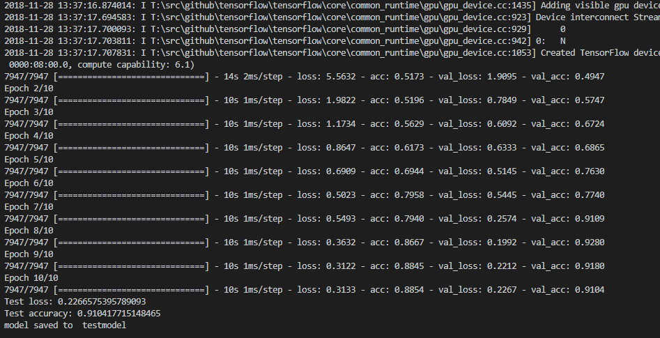

# Audio Classification
## NOTE
The training if much more faster if you have a powerful Nvdia GPU.

By complete this tutorial, you will be able to train a model to predict the class of a sound file.

You need to do some installing and things might just break randomly, so prepare to take a few hours just to get things running. 

You need Python 3, Tensorflow and Keras library to train the neural network model. See this [intruction](https://keras.io/#installation) for installing Tensorflow and Keras. Tensorflow 1.8 and Keras 2.2 is recommended now.

If you want to train your model on GPU, you need CUDA, cuDNN, Python 3 and tensorflow-gpu installed, you need to install those. [Instructions here](https://docs.nvidia.com/deeplearning/sdk/cudnn-install/index.html) (When installing CUDA, uncheck Visual Studio Integration, or the installation will fail). 

If you get missing Python module announcement on terminal during any step below, such as "no module named tqqm", run pip install tqqm.

## Training
- Clone this repository

- Prepare the training data. If you already have a dataset of audios of different categories(classes) with fixed length, you can skip this step:

    - Collect your audios of different categories. Put them into different folders under `scripts/tools` directory of this repository(one folder for each category).
  
    - Split the audio files into clips with fixed length using split.py script. Open Terminal and navigate to `scripts/tools` directory, run the following command for each of your categories
  
   ```
   python split.py audio_directory output_directory output_basefilename clip_length offset
   ```

   Where the `audio_directory` if the category folder that contains all the audio files of that category, `output_directory` is a folder where you want to put the splitted audio clips, `output_basefilename` is the base name for all splitted audio files, `clip_length` is how long in seconds you want to split the audios into(recommend 3), `offset` is the initial offset(0 is ok)

     Use all of your category folders as `audio_directory`, and generate splitted audio files into different for all categories.

     After this step, you should have a bunch of folders, each of which has all audio files of that category, with fixed clip length.

- Train the neural network model

   - Put your training data to the correct place. All training data should be under `input/` folder of this repository. Create a folder of your own name under `input/`, and put all the folders of the splitted audios of different categories under the folder you just created. 
 
   - Run the python script for training. Open Terminal and navigate to `scripts/` directory,run the following command to start training.
   ```
   python basic_classification.py dataset_folder number_of_classes model_save_name training_epoch batch_size sample_limit
   ```
   Where `dataset_folder` is the folder you just created that contains all the training data, `number_of_classes` is how many classes to train(less or equal to the category number your dataset contains),`model_save_name` is the name to save the trained model, `training_epoch` is how long to train, `batch_size` is the mini batch size for training(128 is usually good), and sample_limit is how many audio clips for each category will be used for training at most.

  If everything is working correctly, you should start seeing something lie this:

  

  When the training is done, you should see the training result in the terminal. The trained model will be saved as a file with the name you specified before.

### Use your trained model to classify audios
Now it is time to test your model and see if it can tell the correct categoris of audio files!

- Prepare the audios you want to classify. Create a folder under `scripts/` directory. Put all audio files that you want to classify in it. You don't have to split them.
- Run the python script for classification. Open Terminal and navigate to `scripts/` directory,run the following command to start classifying all the audio files
   ```
   python basic_classification_evaluate.py model_file audio_folder_name clip_length log_file_name
   ```
   Where `model_file` is the path of the model file you generated in previous training, `audio_folder_name` if the folder you  just created that contains all the audios you want to classify, `clip_length` if the clip length you used to train the model and `log_file_name` is the file to where you want to log the result.

   If it is successful, You will see the result on both command window and the generated log file as below. The array of number after each file name is the chance of this audio file belonging to each class.

```
Model: saved_model_3sec2_2400_40
testnonbeatles\01 99 Red Balloons.wav: [8.245988e-05 9.999176e-01]
testnonbeatles\01 All I Wanna Do.wav: [0.00555419 0.994446  ]
testnonbeatles\01 Bad.wav: [1.784438e-10 1.000000e+00]
testnonbeatles\01 Dancing With Mr. D..wav: [0.05785653 0.94214344]
testnonbeatles\01 Dreams.wav: [0.02912167 0.9708783 ]
testnonbeatles\01 Faith.wav: [0.05386437 0.9461357 ]
testnonbeatles\01 Foxy Lady.wav: [0.17748627 0.8225139 ]
testnonbeatles\01 Getaway.wav: [0.08792168 0.9120784 ]
testnonbeatles\01 Hello, I Love You.wav: [0.06171839 0.93828183]
testnonbeatles\01 Hush.wav: [0.9151917  0.08480848]
testnonbeatles\01 It_s My Life.wav: [3.2787937e-09 1.0000000e+00]
testnonbeatles\01 Just Dance.wav: [0.00356663 0.99643344]
testnonbeatles\01 Knocking at Your Back Door.wav: [1.1337274e-05 9.9998897e-01]
testnonbeatles\01 London Calling.wav: [0.00895062 0.99104947]
testnonbeatles\01 Love Is Stronger Than Pride.wav: [9.5814794e-05 9.9990404e-01]
testnonbeatles\01 Material Girl.wav: [5.0986135e-05 9.9994910e-01]
testnonbeatles\01 No More _I Love You's_.wav: [6.005228e-04 9.993994e-01]
```
